<div align="center">


<br/>

[](https://uaelive.zad.tools/ar)
[](apps/web)
[](apps/web)
[](apps/api)
[](infra)
[](apps/web)
[](apps/web)
[](apps/web/public)

**[✨ جرّب المنصة الآن — Try it live → uaelive.zad.tools/ar](https://uaelive.zad.tools/ar)**

</div>

---

**AR** — منصة تراثية تفاعلية تجمع الذكاء الاصطناعي والواقع المعزز عبر المتصفح لإحياء حي الفهيدي التاريخي في دبي: خريطة تفاعلية، توأم رقمي ثلاثي الأبعاد يسافر عبر الحقب، قصص ثنائية اللغة بسرد صوتي، شخصيات تاريخية تحاورك بالبث الحي، تجربة واقع معزز من المتصفح مباشرة، رحلة بحث عن الكنز بين الأزقة والبراجيل، و«خور النجوم» — رحلة ليلية ثلاثية الأبعاد تأمّلية تمشي فيها بين سِكك الحي وبراجيله وتجمع رسائل الأجداد — كل ذلك دون أي تطبيق.

**EN** — An AI + WebAR heritage platform that brings Al Fahidi Historical District (Dubai) to life in the browser: an interactive map, a 3D digital twin across eras, bilingual narrated stories, historical characters you can talk to over live streams, in-browser AR, a scavenger hunt through the alleys and wind towers, and *Creek of Stars* — a meditative 3D night-walk where you gather ancestral letters across the district — no app required.

## ✨ شاهدها حيّة · See it alive

> مقاطع حقيقية مسجَّلة من المنصة المباشرة — *real captures from the live platform.*

<table>
<tr>
<td width="50%" align="center">
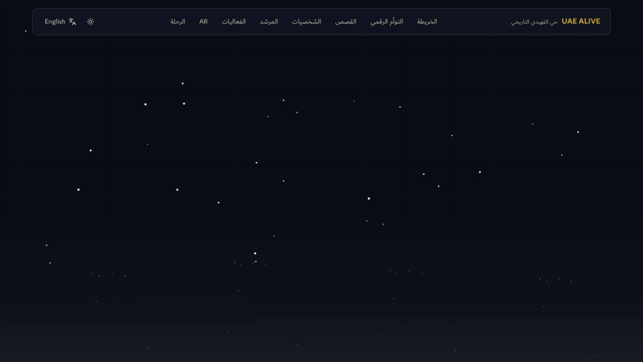
<br/><b>🏠 الصفحة الرئيسية</b> · Arabic‑first cinematic landing
</td>
<td width="50%" align="center">
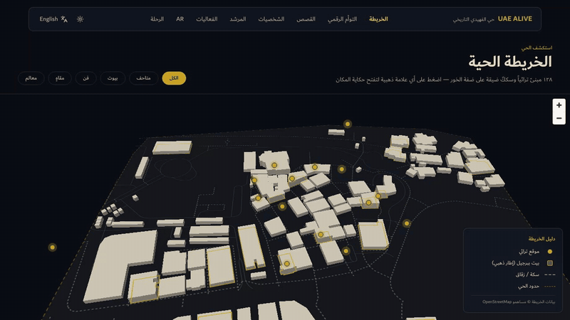
<br/><b>🗺️ الخريطة الحية</b> · 254 real OSM features, 3D buildings, gold POI markers
</td>
</tr>
<tr>
<td width="50%" align="center">

<br/><b>🕰️ التوأم الرقمي</b> · era slider 1950 → اليوم over the same GeoJSON
</td>
<td width="50%" align="center">

<br/><b>🌙 خور النجوم</b> · meditative Three.js night‑walk through the sikkas
</td>
</tr>
</table>

## 📸 جولة مصوّرة · Screenshot tour

<table>
<tr>
<td width="33%" align="center">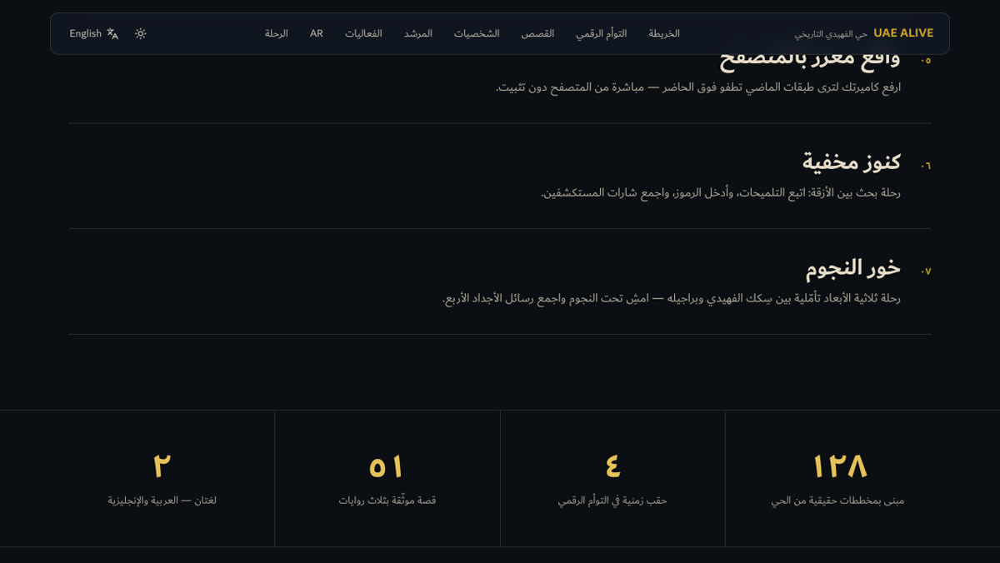<br/><sub><b>الرئيسية</b> · Landing</sub></td>
<td width="33%" align="center">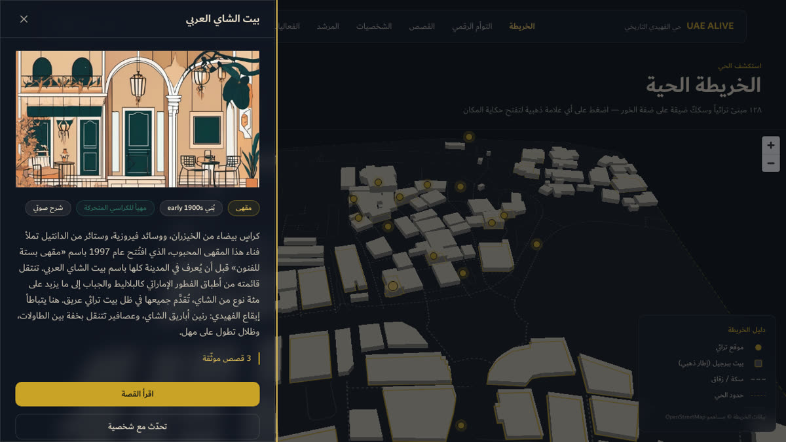<br/><sub><b>الخريطة + الدُرج الزجاجي</b> · Map & glass drawer</sub></td>
<td width="33%" align="center">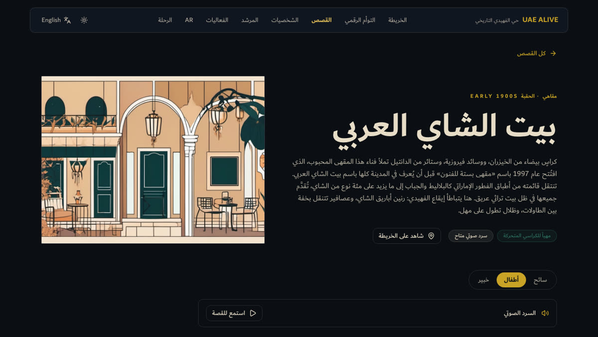<br/><sub><b>القصص المسرودة</b> · Narrated stories</sub></td>
</tr>
<tr>
<td width="33%" align="center">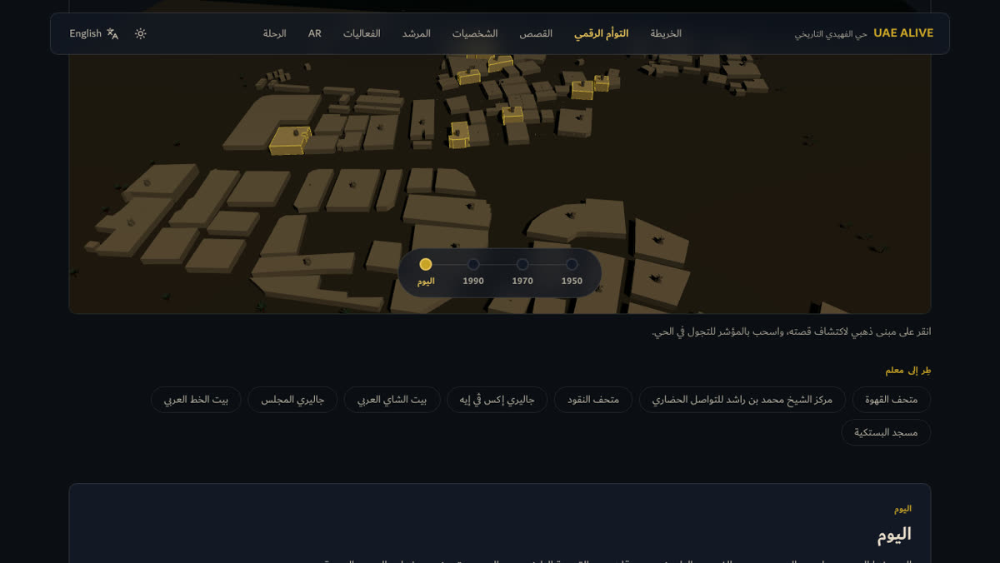<br/><sub><b>التوأم الرقمي</b> · Digital twin</sub></td>
<td width="33%" align="center">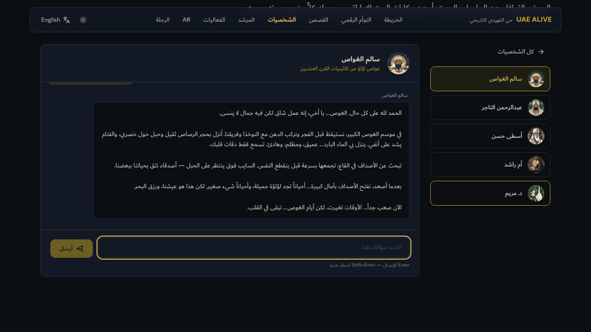<br/><sub><b>شخصيات تحكي</b> · Streaming AI characters</sub></td>
<td width="33%" align="center">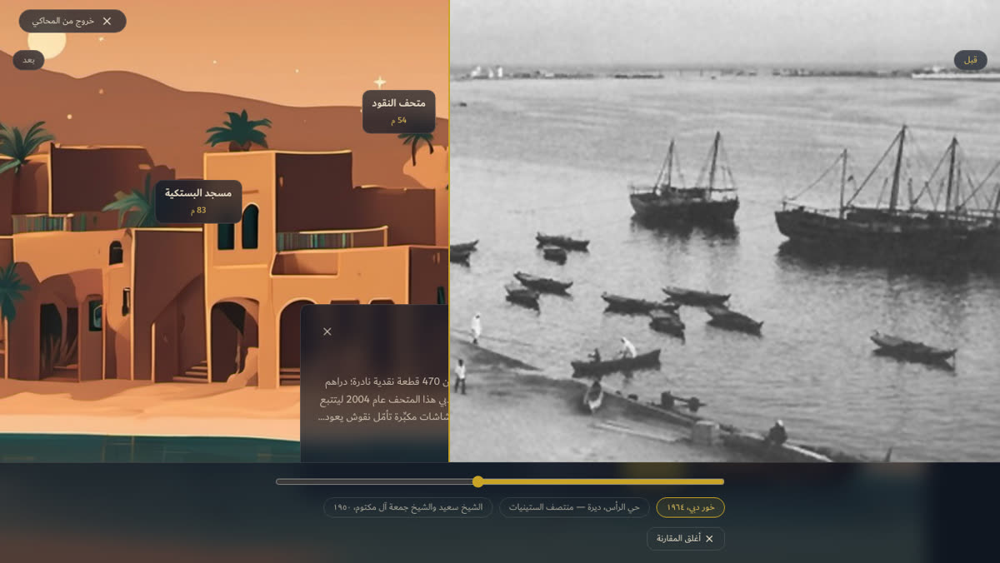<br/><sub><b>الواقع المعزز</b> · WebAR</sub></td>
</tr>
<tr>
<td width="33%" align="center">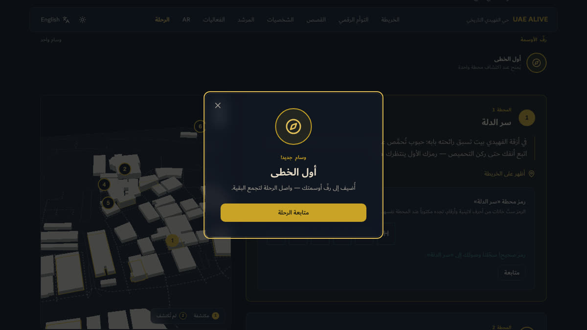<br/><sub><b>رحلة الكنز</b> · Treasure hunt</sub></td>
<td width="33%" align="center">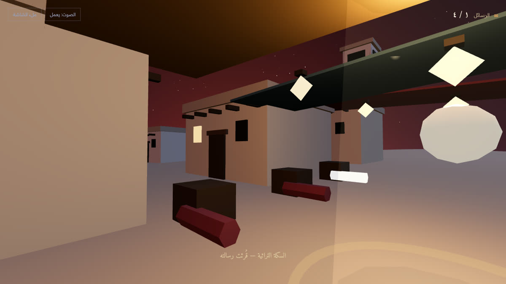<br/><sub><b>عالم خور النجوم</b> · Creek of Stars</sub></td>
<td width="33%" align="center">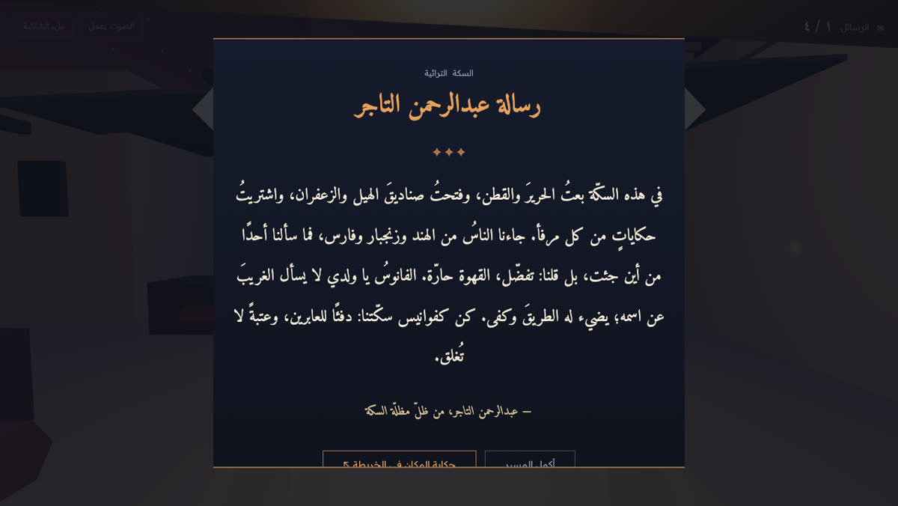<br/><sub><b>رسائل الأجداد</b> · Ancestral letters</sub></td>
</tr>
</table>

## 🧭 Experiences

| Route | What it does |
|---|---|
| `/ar` · `/en` | 🏠 Cinematic bilingual landing (Arabic-first, RTL) |
| `/map` | 🗺️ MapLibre district map — 254 real OSM features, 3D-extruded buildings, 17 POI markers, glass drawer, `?poi=` deep links |
| `/twin` | 🕰️ React-Three-Fiber digital twin built from the same GeoJSON, era slider (1950 / 1970 / 1990 / اليوم) driving sky + props |
| `/stories` | 📖 51 researched stories (tourist / kids / expert × 17 POIs), voice narration (pre-rendered EN audio, browser TTS AR), sources |
| `/characters` | 💬 5 AI characters (pearl diver, merchant, builder, Umm Rashid, historian) — SSE streaming chat with offline fallback |
| `/copilot` | 🤖 AI Tour Copilot — pick interests + duration + audience, get a streamed personalized walking route over the real POIs (offline fallback tour) |
| `/events` | 🎪 Public seasons calendar — festivals, exhibitions, markets, Ramadan, National Day, with live/upcoming/past status |
| `/ar-experience` | 📱 WebAR: camera magic-window + MindAR marker tracking, desktop simulator fallback that always works |
| `/hunt` | 🏆 Treasure hunt — 6 stops, secret codes, badges, server-side progress per anonymous device |
| `/community` | 🤝 Moderated community submissions (stories, photos, memories, documents) |
| `/fahidi` | 🌙 «خور النجوم» Creek of Stars — meditative 3D night-walk through Al Fahidi (vanilla Three.js, Arabic, fully procedural), four ancestral letters deep-linked to the map POIs |
| `/admin` | 🔐 CMS: bilingual CRUD for POIs/stories/events, moderation queue, analytics dashboard |

## 🏗️ Architecture at a glance

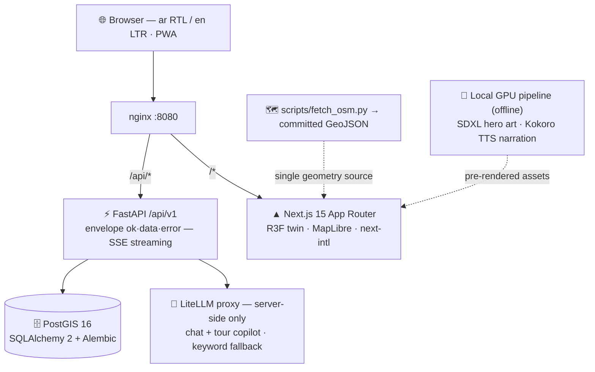

> التفاصيل الكاملة في [docs/architecture.md](docs/architecture.md) — *the map and the 3D twin render the exact same committed OSM GeoJSON.*

## 🛠️ Stack

- **Frontend:** Next.js 15 (App Router), TypeScript strict, Tailwind v4, React Three Fiber, MapLibre GL, next-intl (Arabic-first, RTL), Playwright E2E
- **Typography:** [Dubai Font](https://dubaifont.com) — the emirate's official bilingual typeface, self-hosted (one family for Arabic + Latin, no runtime CDN)
- **PWA:** installable — web manifest, barjeel app icons (192/512/maskable + Apple), theme color, styled 404
- **Backend:** FastAPI, SQLAlchemy 2, GeoAlchemy2, Alembic, Pydantic v2, slowapi rate limits — `/api/v1` with `{ok, data, error}` envelope, SSE streaming
- **Data:** PostGIS (postgis/postgis:16-3.4), seed knowledge base in `data/*.json`, OSM-derived GeoJSON (`scripts/fetch_osm.py`)
- **AI:** server-side only via LiteLLM proxy (chat + tour copilot), keyword-scored canned fallback when offline; hero art generated with SDXL, EN narration with Kokoro TTS — both on a local GPU
- **Infra:** Docker Compose + nginx (everything on `http://localhost:8080`)

## 🚀 Quickstart

```bash
cp .env.example .env        # fill in LITELLM_* and ADMIN_PASSWORD

# Option A — full stack in Docker (migrates + seeds automatically)
make up                     # → http://localhost:8080

# Option B — local dev
make db                     # PostGIS on localhost:5433
make dev-api                # FastAPI on :8000 (run `make seed` once)
make dev-web                # Next.js on :3000
make test                   # backend tests (pytest against PostGIS)
cd apps/web && npx playwright test   # E2E smoke (needs api :8000)
```

## 🎬 Demo script (8 stops, ~6 minutes)

1. **`/ar`** — scroll the cinematic hero; note the RTL-first typography and barjeel skyline.
2. **`/ar/map`** — click the gold مقهى marker (Arabian Tea House); open «اقرأ القصة» from the drawer.
3. **Story page** — switch سائح → أطفال, then hit **Listen** on the EN version (pre-rendered GPU audio).
4. **`/ar/twin`** — drag the era slider 1950 → اليوم; click a gold-edged building for its info card.
5. **`/ar/characters`** — ask سالم الغواص: «كيف كان الغوص على اللؤلؤ؟» — answers stream live in character.
6. **`/ar/ar-experience`** — desktop: open the simulator (works on any projector); mobile: point the camera.
7. **`/ar/hunt`** — enter code `DALLAH` at محطة متحف القهوة; watch the progress bar and first badge.
8. **`/fahidi`** — headphones on: start «خور النجوم», walk the main sikka to بيت البراجيل, read أم راشد's letter, then hit «حكاية المكان في الخريطة» — it deep-links back to the same POI on the map. Fully procedural Three.js, zero CDN, works offline.

## 📚 Documentation

- [docs/architecture.md](docs/architecture.md) — system diagram, data flow, design decisions
- [docs/runbook.md](docs/runbook.md) — operations: migrate, seed, E2E, deploy, key rotation, GPU asset pipeline
- [docs/openapi.json](docs/openapi.json) — exported OpenAPI spec (25 endpoints)
- [docs/review-log.md](docs/review-log.md) — adversarial review findings and resolutions
- [docs/superpowers/specs/](docs/superpowers/specs/) · [docs/superpowers/plans/](docs/superpowers/plans/) — design spec and the 20-task implementation plan

## 📝 Notes

- Camera AR requires HTTPS in production (localhost is exempt in modern browsers).
- The mosque, wind-tower house, and old-wall heroes intentionally keep purpose-drawn SVGs — generated art could not match their real flat-roofed/barjeel geometry, and historical accuracy wins.
- `majlis-gallery` content presents the gallery's 1989 founding and legacy carefully — reports suggest it closed permanently around 2020.

---

<div align="center">

🌙 **صُنعت بحُبّ لحي الفهيدي التاريخي — دبي** · *Made with ❤️ for Al Fahidi Historical District, Dubai*

**[uaelive.zad.tools/ar](https://uaelive.zad.tools/ar)**

</div>
